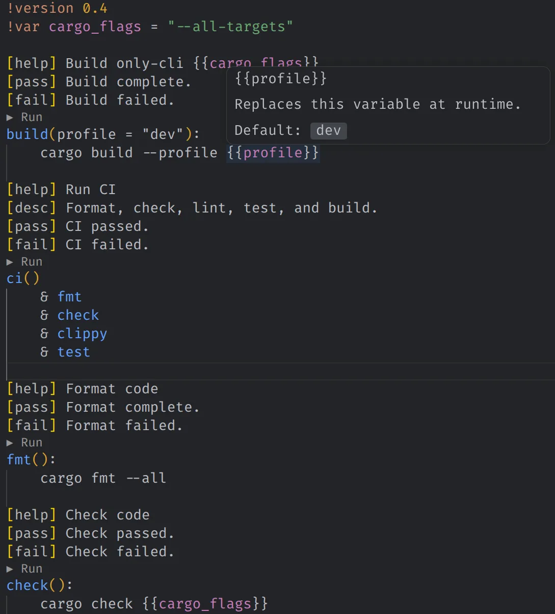

# Onlyfile for VS Code

Write your workflow once, then see it, run it, and understand it directly in VS Code.

Onlyfile brings the [Only](https://github.com/KercyDing/only) task language to your editor with syntax highlighting, live diagnostics, hover information, and one-click task execution.



## Built around the Onlyfile syntax

Keep commands, dependencies, parallel groups, guards, and task messages together in one readable file:

```onlyfile
ci()
    & _prepare
    & (front.check, back.check)
    & (front.test, back.test)
```

The extension understands the structure of your workflow instead of treating it as plain text:

- syntax highlighting for directives, tasks, parameters, dependencies, groups, and metadata
- diagnostics while you write
- hover details for tasks, parameters, and interpolated values
- folding and document symbols for groups and task blocks
- formatting through `only --fmt`
- a `Run` action above every runnable task
- support for task parameters, default values, guards, and parallel dependencies

Tasks with a leading `_` are kept as implementation details, and tasks that still need a required parameter do not show a misleading `Run` action.

## Command palette

Use the Command Palette to manage the language server without leaving your editor:

- `Onlyfile: Restart LSP` — restart the Onlyfile language server

For everyday use, the quickest path is the `Run` action shown directly above a task. Group tasks are invoked with the same syntax as the CLI, for example `only back test`.

## Get started

1. Install the **Onlyfile** extension.
2. Install the [Only CLI](https://github.com/KercyDing/only) and make sure `only` is available on your `PATH`.
3. Open a file named `Onlyfile` or `onlyfile`.
4. Click `Run` above a task to execute it.

See the [Only usage guide](https://github.com/KercyDing/only/blob/master/docs/usage.md) for the complete language and CLI reference.

The extension bundles the language server for supported macOS, Linux, and Windows platforms. Syntax highlighting remains available even when the language server cannot be started.

## Environment variables

Use these only when you need to point the extension at a locally built language server:

```bash
ONLY_LSP_DIR=/path/to/directory/containing/only-lsp
```

Or provide the exact server binary:

```bash
ONLY_LSP_BIN=/path/to/only-lsp
```
